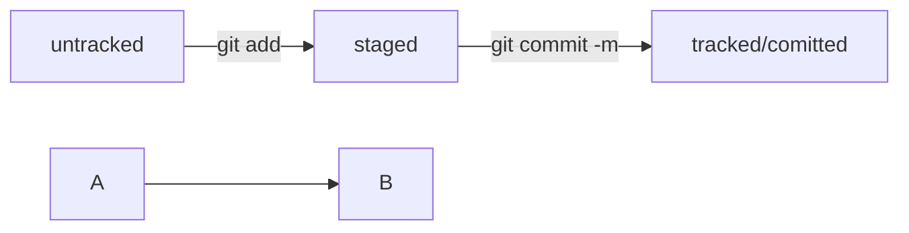

# Шпаргалка по работе с консолью 

---

## Навигация

- **pwd** (от англ. print working directory, «показать рабочую папку») — покажи, в какой я папке;
- **ls** (от англ. list directory contents, «отобразить содержимое директории») — покажи файлы и папки в текущей папке;
- **ls** -a — покажи также скрытые файлы и папки, названия которых начинаются с символа .;
- **cd** first-project (от англ. change directory, «сменить директорию») — перейди в папку first-project;
- **cd** first-project/html — перейди в папку html, которая находится в папке first-project;
- **cd** .. — перейди на уровень выше, в родительскую папку;
- **cd** ~ — перейди в домашнюю директорию (/Users/Username);
- **cd** / — перейди в корневую директорию.

--- 


## Формат описания схем Mermaid.

Принцип такой: описывается схема в специальном текстовом формате, а GitHub превращает описание в полноценную схему с блоками и стрелками.

Чтобы получить ```mermaid```-схему в ```README.md```, нужно добавить блок кода типа ```mermaid```.
```
HEAD -- это голова.
Коммит -- это всему голова.
Статусы файлов:
<тут пустая строка!>

```mermaid
%% описание схемы

<и тут пустая строка!>
```

* Блоки кода в маркдауне начинаются и заканчиваются тремя символами ```. После первых трёх ``` можно указать, какой именно код будет внутри блока. Например: ```mermaid , ```bash, ```python, ```javascript и так далее. Если ничего не указать, GitHub будет считать весь код простым текстом.

###  Перед блоком и после него нужны пустые строки, иначе GitHub может не понять, что это блок кода.

* Два символа %% обозначают в mermaid строку-комментарий. 
* Чтобы сделать схему, нужно указать формат: **graph LR**. **Graph** — это простейший тип схем; для шпаргалки его будет достаточно.
* Чтобы добавить элементы и связи (стрелки), используют строки вида ```A --> B```. Такая строка создаст квадратные блоки ```А``` и ```B``` и соединит их стрелкой.

Дополнительно можно указывать текст на стрелке. Например, так: ```A -- "text" --> B```.

## Заготовка для схемы статусов файлов:


